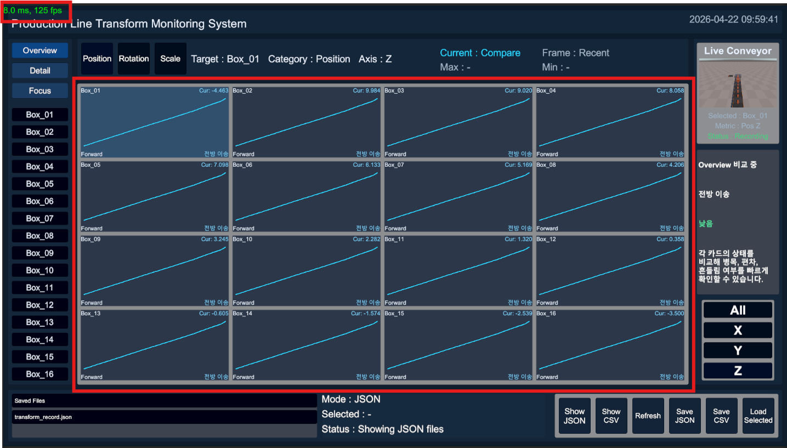
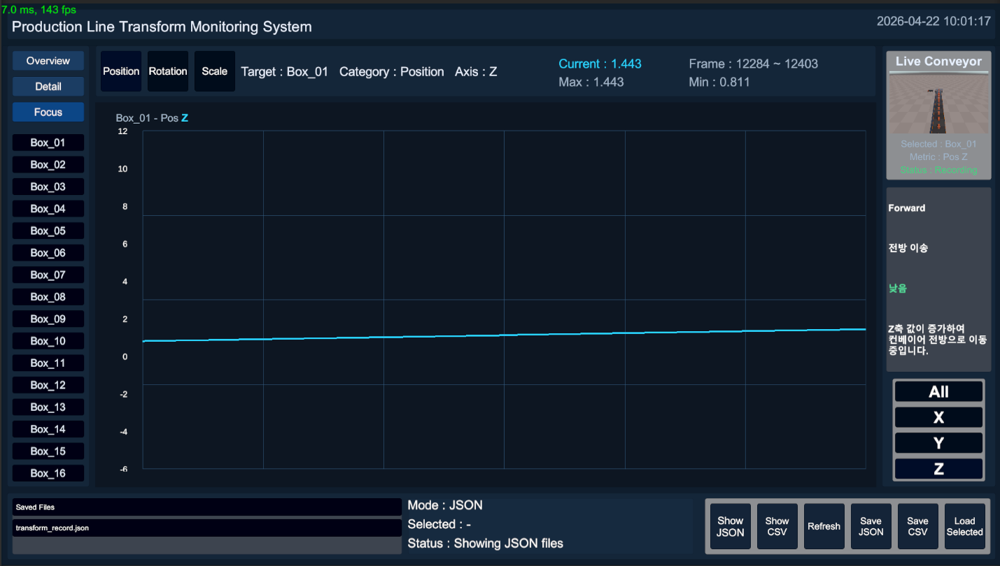
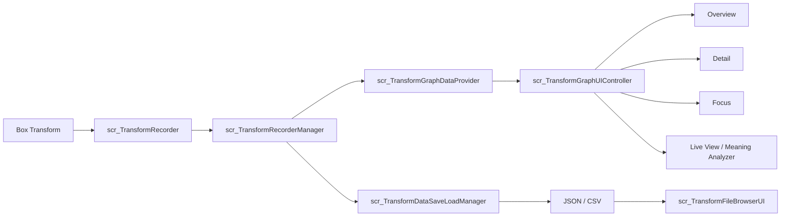
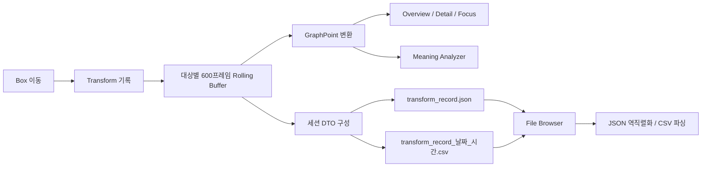
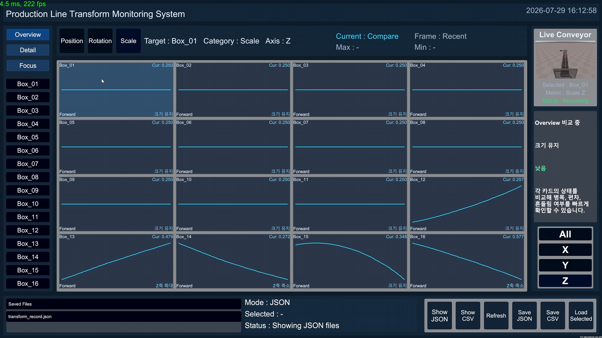
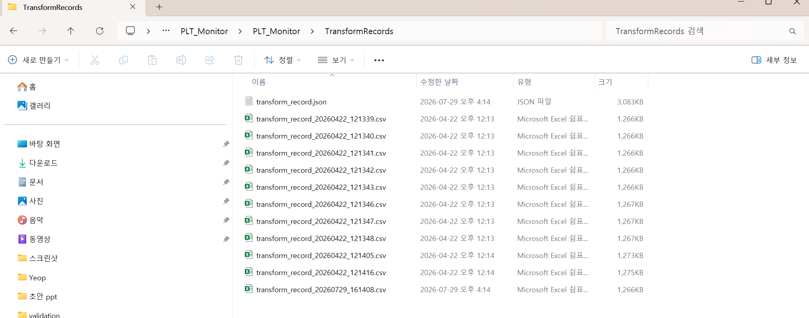

# PLT Monitor

> Unity 기반 생산 라인 Transform 기록·그래프 분석·JSON/CSV 저장 시스템

<p align="center">
  
</p>

## 프로젝트 정보

| 항목 | 내용 |
|---|---|
| 개발 형태 | 교육 과정 기반 개인 프로젝트 |
| 구현 범위 | 생산 라인 시뮬레이션, 16개 대상 Transform 기록, 그래프 분석, JSON·CSV 저장·조회, Windows 빌드 |
| 개발 환경 | Unity 6000.3.10f1, C# |
| 실행 환경 | Windows Intel 64-bit |
| 프로젝트 상태 | 주요 기능 구현 및 Windows Standalone 검증 완료 |

## 프로젝트 개요

생산 라인에서 이동하는 여러 오브젝트의 Position·Rotation·Scale 변화를 실시간으로 기록하고 비교하기 위해 제작한 Unity 기반 모니터링 시스템입니다. Box 16개를 Object Pool로 순환시키고, 대상별 최근 600프레임을 Rolling Buffer로 유지합니다.

수집한 데이터는 Overview·Detail·Focus 그래프로 단계적으로 분석하고, 선택 대상을 추적하는 Live View와 규칙 기반 Meaning Analyzer를 함께 표시합니다. 현재 세션은 JSON·CSV로 저장하며 File Browser에서 파일 목록, 선택과 파싱 결과를 확인할 수 있습니다.

## 데모

### 실시간 모니터링 및 그래프 시연

16개 대상의 Transform 기록과 Overview 그래프, 대상 선택 동작을 확인할 수 있습니다.

https://github.com/user-attachments/assets/5973c678-59f6-48cf-a15d-346f24e00b91

### 상세 분석 및 라이브 뷰 시연

선택 대상의 Detail·Focus 그래프와 Live View 추적 동작을 확인할 수 있습니다.

https://github.com/user-attachments/assets/5bbb2cfb-b2da-4470-ba87-c00d774ec29e

### JSON·CSV 저장 및 성능 검증

기록 데이터의 JSON·CSV 저장과 파일 조회, Unity Profiler 측정 과정을 확인할 수 있습니다.

https://github.com/user-attachments/assets/a8eb7123-b27e-424a-8473-f7f4d33b0a5e

## 주요 기능

### Overview·Detail·Focus 그래프

Overview는 16개 대상을 카드형 미니 그래프로 비교합니다. 대상을 선택하면 Detail에서 X·Y·Z·All 시리즈를 4분면으로 확인하고, Focus에서 특정 축의 최근 변화를 확대합니다.

<table>
  <tr>
    <td width="50%"></td>
    <td width="50%"></td>
  </tr>
  <tr>
    <td align="center">Overview</td>
    <td align="center">Detail</td>
  </tr>
  <tr>
    <td colspan="2"></td>
  </tr>
  <tr>
    <td colspan="2" align="center">Focus</td>
  </tr>
</table>

### 실시간 Transform 기록

각 Box의 월드 Position, Euler Rotation과 Local Scale의 X·Y·Z를 프레임 단위로 기록합니다. 대상별 최대 600프레임을 유지하며 초과한 오래된 데이터는 제거합니다.

```text
16 Objects × 600 Frames = 최대 9,600 Frames
9 Transform Values per Frame
```

### Live View 및 상태 해석

선택한 Box를 카메라로 추적하고 현재 대상, Metric과 Recording 상태를 표시합니다. 최근 데이터 구간의 변화량과 범위를 기준으로 상태·의미·위험도·인사이트를 생성합니다.

<p align="center">
  
</p>

Meaning Analyzer는 Position Z를 전방 이송축으로 가정한 규칙 기반 해석이며, 학습형 AI 예측 모델은 아닙니다.

### JSON·CSV 저장 및 파일 조회

현재 Recorder 데이터를 세션 단위 DTO로 집계해 JSON 또는 CSV 파일로 저장합니다. File Browser에서 확장자별 목록을 조회하고 선택한 파일의 파싱 성공 여부와 상태 메시지를 확인합니다.

<p align="center">
  
</p>

`Load Selected`는 JSON 역직렬화 또는 CSV 파싱까지 수행합니다. 로드한 데이터를 Recorder에 다시 주입하거나 과거 세션 그래프로 재생하는 기능은 현재 범위에 포함되지 않습니다.

## 시스템 구성



- Recorder Layer: 각 대상의 Transform을 최근 600프레임으로 기록
- Manager Layer: 16개 Recorder 검색과 일괄 Start·Stop·Clear
- Graph Layer: Recorder 데이터를 시리즈로 변환하고 Overview·Detail·Focus에 표시
- Interpretation Layer: 최근 프레임의 변화량과 범위를 규칙으로 해석
- Save/File Layer: 세션 집계, JSON·CSV 저장, 파일 목록과 파싱 상태 표시

자세한 구성은 [시스템 아키텍처](docs/02-architecture.md)에서 확인할 수 있습니다.

## 데이터 흐름



런타임 파일은 `Application.persistentDataPath/PLT_Monitor/TransformRecords` 아래에 저장됩니다. 자세한 구조는 [데이터 흐름](docs/04-data-flow.md)에 정리했습니다.

## 기술 스택

| 구분 | 기술 |
|---|---|
| Engine | Unity 6000.3.10f1 |
| Language | C# |
| Rendering | Universal Render Pipeline 17.3.0 |
| UI | Unity uGUI 2.0.0 |
| Input | Input System 1.18.0 |
| Serialization | Newtonsoft Json 3.2.2 |
| 데이터·출력 | JSON·CSV 저장 / 실시간 그래프 시각화 |
| Target | Windows Intel 64-bit |

## 실행 환경

- Unity Editor: `6000.3.10f1`
- Build Target: Windows Intel 64-bit
- Main Scene: `Assets/Scenes/PL_TransformMonitor.unity`
- Build Scene: 활성화 확인
- 저장 경로: `Application.persistentDataPath/PLT_Monitor/TransformRecords`

## 실행 방법

1. Unity Hub에서 저장소 폴더를 엽니다.
2. Unity `6000.3.10f1`로 프로젝트를 엽니다.
3. `Assets/Scenes/PL_TransformMonitor.unity` Scene을 엽니다.
4. Console Error가 없는지 확인한 뒤 Play Mode에서 기능을 확인합니다.
5. Windows 실행 파일은 `File > Build Profiles > Windows`에서 `Intel 64-bit`로 빌드합니다.
6. 생성된 `PLT_Monitor.exe`를 실행하고 그래프와 저장 동작을 확인합니다.

## 검증 결과

| 검증 항목 | 결과 | 확인 내용 |
|---|---|---|
| 생산 라인 순환 | PASS | Box 16개 Spawn·이동·재활용 |
| Transform 기록 | PASS | Position·Rotation·Scale의 X·Y·Z 기록 |
| Rolling Buffer | PASS | 대상별 최근 600프레임 유지 |
| Overview | PASS | 16개 카드 그래프와 대상 선택 |
| Detail | PASS | 선택 대상의 X·Y·Z·All 4분면 표시 |
| Focus | PASS | 선택 축 확대와 Current·Min·Max 표시 |
| Live View | PASS | 선택 대상 추적과 현재 상태 표시 |
| Meaning Analyzer | PASS | 규칙 기반 상태·의미·위험도 표시 |
| JSON 저장·파싱 | PASS | 파일 생성, 역직렬화와 상태 메시지 |
| CSV 저장·파싱 | PASS | 파일 생성, 행 파싱과 상태 메시지 |
| 일반 실행 성능 | PASS | 요구 기준 60FPS 이상, 기존 QA 기록상 100FPS 이상 |
| Windows Build | PASS | Intel 64-bit Standalone 실행 확인 |
| 저장 순간 성능 | Known Issue | CPU·GC Spike 후 기존 FPS 수준으로 회복 |

<table>
  <tr>
    <td width="50%"></td>
    <td width="50%"></td>
  </tr>
  <tr>
    <td align="center">Windows Standalone 실행</td>
    <td align="center">JSON·CSV 파일 생성</td>
  </tr>
</table>

<p align="center">
  
</p>
<p align="center">Unity Profiler 측정 화면</p>

세부 검증 항목과 근거는 [검증 결과](docs/05-validation.md)와 [최종 기능 테스트 체크리스트](docs/qa/final-test-checklist.md)에 정리했습니다.

## 프로젝트 구조

```text
Assets
├─ Art
├─ Docs
├─ Materials
├─ Models
├─ Prefabs
│  ├─ Basic
│  ├─ Control
│  ├─ Scne Conveyor
│  └─ UI
├─ Scenes
│  └─ PL_TransformMonitor.unity
├─ Scripts
│  ├─ Data
│  ├─ ProductionLine
│  ├─ SaveLoad
│  └─ UI
└─ Settings
```

주요 Prefab과 클래스 구성은 [프로젝트 구조](docs/07-project-structure.md)에서 확인할 수 있습니다.

## 문제 해결 및 최종 구현 범위

PLT Monitor는 구현과 검증을 완료한 교육 평가 프로젝트입니다.

- 16개 오브젝트의 Transform을 실시간으로 기록했습니다.
- 기록 데이터는 최근 600프레임만 순환 보관하도록 구성했습니다.
- Overview·Detail·Focus 단계별 그래프를 구현했습니다.
- JSON 저장과 CSV 내보내기 기능을 구현했습니다.
- Unity Profiler로 저장 순간의 CPU·GC 사용량을 확인했습니다.
- 기록·관리·그래프 조회·파일 저장·저장 UI의 역할을 분리했습니다.

구현 과정에서 발생한 문제와 처리 결과는 [문제 해결 및 최종 구현 범위](docs/06-project-scope.md)에 정리했습니다.
## 상세 문서

| 문서 | 내용 |
|---|---|
| [Documentation](docs/README.md) | 상세 문서 전체 목차 |
| [01. Overview](docs/01-overview.md) | 개발 목적과 구현 범위 |
| [02. Architecture](docs/02-architecture.md) | Recorder·그래프·저장 계층 |
| [03. Features](docs/03-features.md) | 생산 라인과 그래프 기능 |
| [04. Data Flow](docs/04-data-flow.md) | Transform 기록과 JSON·CSV 처리 |
| [05. Validation](docs/05-validation.md) | 테스트 환경과 검증 결과 |
| [06. Project Scope](docs/06-project-scope.md) | 성능 병목과 현재 범위 |
| [07. Project Structure](docs/07-project-structure.md) | 폴더·Prefab·스크립트 구성 |
| [Final Test Checklist](docs/qa/final-test-checklist.md) | 세부 기능 테스트 항목 |
| [Presentation](docs/presentation/PLT_Monitor.pptx) | 프로젝트 발표 자료 |

## 외부 리소스 및 라이선스

이 저장소는 포트폴리오 검토를 목적으로 공개합니다. Unity, Newtonsoft.Json, TextMesh Pro, 폰트와 외부 에셋의 권리는 각 제작자 및 배포처의 라이선스를 따릅니다. 사용 항목과 확인이 필요한 범위는 [Third-Party Notices](THIRD_PARTY_NOTICES.md)에 정리했습니다. 별도 라이선스가 명시되지 않은 프로젝트 코드와 문서는 무단 재배포를 허용하지 않습니다.
