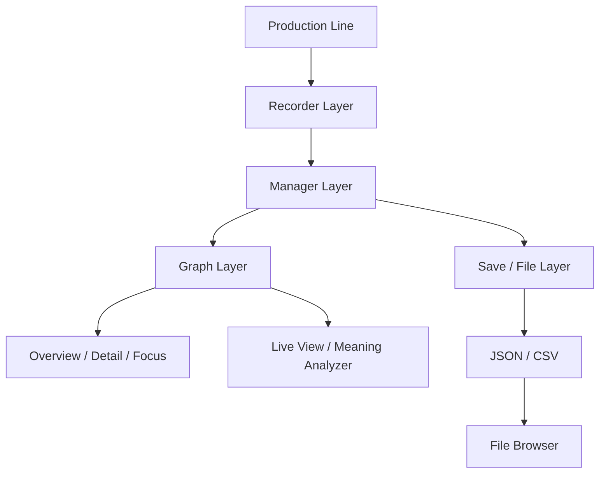
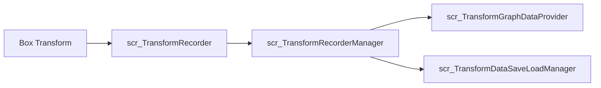
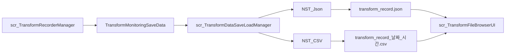

# 02. Architecture

## 전체 구조



## Production Line 계층

```text
scr_ConveyorSpawnManager
├─ Box Pool 초기화
├─ Spawn 간격과 영역 확인
├─ 비활성 Box 재사용
└─ EndPoint 도달 대상 회수

scr_ConveyorItemMover
├─ StartPoint에서 활성화
├─ 지정 방향과 속도로 이동
└─ EndPoint 도달 여부 제공
```

Spawn·Recycle 책임은 Manager에, 실제 이동은 개별 Item에 분리했습니다.

## Recorder 계층



- `scr_TransformRecorder`: 월드 Position, Euler Rotation과 Local Scale 기록
- `scr_TransformRecorderManager`: Scene의 Recorder 검색, 전체 Start·Stop·Clear
- `TransformFrameData`: 한 프레임의 시간과 9개 Transform 값
- `TransformObjectRecordData`: 대상 이름과 프레임 목록
- `TransformMonitoringSaveData`: 세션 이름, 생성 시간과 전체 대상 목록

## Graph 계층

```text
scr_TransformGraphDataProvider
→ scr_TransformGraphUIController
├─ scr_TransformGraphOverviewController
├─ scr_TransformOverviewGraphCard
├─ scr_TransformGraphDetailQuadController
├─ scr_TransformGraphRenderer
├─ scr_TransformGraphLiveViewController
└─ scr_TransformGraphMeaningAnalyzer
```

| 클래스 | 역할 |
|---|---|
| `scr_TransformGraphDataProvider` | Recorder 데이터를 GraphPoint 시리즈로 변환 |
| `scr_TransformGraphUIController` | 모드·대상·카테고리·축 선택 상태 총괄 |
| `scr_TransformGraphOverviewController` | 16개 Overview 카드 생성과 갱신 |
| `scr_TransformOverviewGraphCard` | 대상별 미니 그래프와 상태 표시 |
| `scr_TransformGraphDetailQuadController` | X·Y·Z·All 4분면 표시 |
| `scr_TransformGraphRenderer` | Grid, 축, 단일·다중 시리즈 렌더링 |
| `scr_TransformGraphLiveViewController` | 선택 대상 추적 카메라와 확대 화면 |
| `scr_TransformGraphMeaningAnalyzer` | 최근 데이터 구간의 규칙 기반 해석 |

## Save / File 계층



`scr_TransformDataSaveLoadManager`가 Recorder 목록을 세션 DTO로 복사한 뒤 직렬화합니다. `scr_TransformFileBrowserUI`는 저장 버튼, 확장자별 목록, 파일 선택과 Load 상태 메시지를 관리합니다.

## Scene과 Prefab 구성

메인 Scene은 `Assets/Scenes/PL_TransformMonitor.unity`이며 Build Settings에 활성화돼 있습니다. 주요 기능은 `PF_PL_Root`, `PF_GraphSystem`, Production Line·TrackObjects·Graph UI Prefab으로 분리했습니다.

<p align="center">
  
</p>

## 설계 기준

- 대상별 기록과 전체 관리 책임 분리
- Recorder 데이터와 Graph 렌더링 분리
- Overview에서 Detail, Focus로 분석 범위 축소
- 저장용 DTO와 런타임 Recorder 구조 분리
- 파일 로드는 파싱 결과와 UI 상태까지만 명확히 제한
- 외부 에셋 없이 핵심 그래프 기능이 실행되도록 Point Marker 교체

[문서 목차로 돌아가기](README.md)
