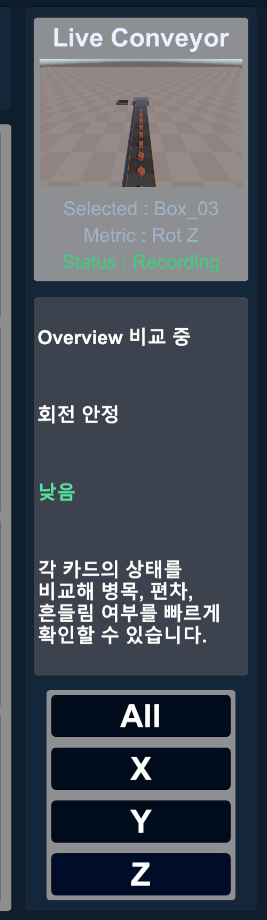

# 03. 주요 기능

## 생산 라인 및 Object Pool

`scr_ConveyorSpawnManager`가 16개 Box를 Pool로 관리합니다. Spawn 영역이 비어 있고 지정 간격이 지난 경우 비활성 대상을 재사용하며, EndPoint에 도달한 대상은 다시 비활성화합니다.

`scr_ConveyorItemMover`는 StartPoint·EndPoint와 이동 속도를 받아 자신의 이동만 처리합니다.

## Transform Recorder

각 Box의 `scr_TransformRecorder`가 다음 값을 프레임 단위로 기록합니다.

- 월드 Position X·Y·Z
- Euler Rotation X·Y·Z
- Local Scale X·Y·Z
- `frameIndex`
- `timeStamp`

기본 최대 프레임 수는 600이며 초과 시 가장 오래된 프레임부터 제거합니다. Manager는 Recorder 검색, 전체 Start·Stop·Clear/Restart를 제공합니다.

## Overview

16개 대상을 카드형 미니 그래프로 동시에 표시합니다. 전체 흐름을 비교하고 정지, 편차나 흔들림이 의심되는 대상을 찾는 첫 단계입니다. 카드를 선택하면 해당 대상의 Detail로 이동합니다.

  

## Detail

선택한 대상의 X·Y·Z와 All 시리즈를 4분면에 표시합니다. 동일한 Transform 카테고리에서 축별 변화 차이를 비교합니다.

  

## Focus

선택한 단일 축을 큰 그래프로 표시합니다. 최근 구간의 변화, 튐, 정지와 노이즈를 확인합니다.

  

## Live View

선택된 Box를 카메라가 추적하고 대상명, 현재 Metric과 Recording 상태를 표시합니다. Right Panel에서 All·X·Y·Z 선택과 상태 해석을 함께 확인할 수 있습니다.

  

## Meaning Analyzer

최근 30개 GraphPoint의 시작값·종료값·최소·최대 범위를 이용해 상태를 해석합니다.

| 카테고리 | 프로젝트 기준 |
|:---|:---|
| Position Z | 컨베이어 전방 이송축 |
| Position X | 좌우 편차 |
| Position Y | 상하 흔들림 |
| Rotation X·Y | 기울어짐 |
| Rotation Z | 방향 정렬 |
| Scale X·Y·Z | 크기 유지 또는 변형 |

결과는 `State`, `Meaning`, `Risk`, `Insight` 문구로 표시합니다. 이 기능은 고정 임계값을 사용하는 규칙 기반 해석이며 학습형 모델이 아닙니다.

## JSON·CSV 저장

- JSON: 동일한 `transform_record.json` 파일에 현재 세션 저장
- CSV: `transform_record_yyyyMMdd_HHmmss.csv` 이름으로 새 파일 생성
- 저장 데이터: 세션 정보, 대상명, 모든 기록 프레임과 9개 Transform 값

## File Browser 및 Load Selected

- Show JSON·Show CSV
- Refresh
- Save JSON·Save CSV
- 파일 목록과 선택 상태
- 선택한 JSON 역직렬화
- 선택한 CSV 행 파싱
- 성공·실패 상태 메시지

  

`Load Selected`는 선택한 JSON 파일의 역직렬화 또는 CSV 행 파싱을 수행하고 성공·실패 상태를 File Browser에 표시합니다.

---

[문서 목차](README.md) · [프로젝트 README](../README.md)
