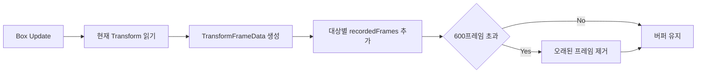
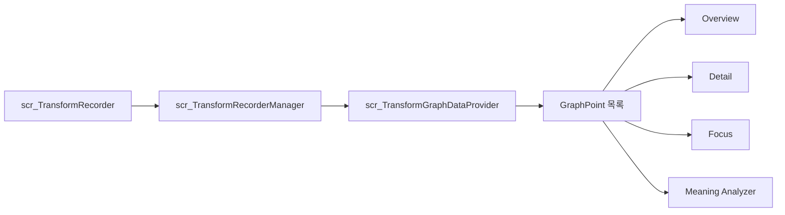
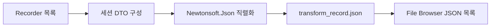
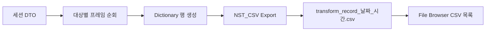
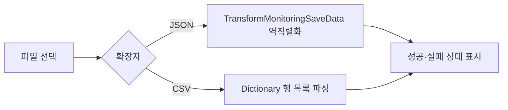

# 04. 데이터 흐름

## Transform 기록 흐름



`recordWhenInactive`가 비활성 상태이면 활성화된 Box만 기록합니다. `GetRecordedFrames()`는 내부 목록의 복사본을 반환해 외부 계층이 Recorder 버퍼를 직접 수정하지 않도록 합니다.

## Graph 데이터 흐름



Graph Data Provider는 Position·Rotation·Scale과 X·Y·Z 선택에 따라 필요한 값만 GraphPoint로 변환합니다. UI Controller는 현재 모드와 대상 선택을 유지하고 각 Renderer와 해석 영역을 갱신합니다.

## 저장 데이터 모델

### TransformFrameData

| 구분 | 필드 |
|:---|:---|
| 식별 | `frameIndex`, `timeStamp` |
| Position | `posX`, `posY`, `posZ` |
| Rotation | `rotX`, `rotY`, `rotZ` |
| Scale | `scaleX`, `scaleY`, `scaleZ` |

### Session 구조

```text
TransformMonitoringSaveData
├─ sessionName
├─ createdTimeText
└─ objects
   ├─ objectName
   └─ frames
      └─ TransformFrameData
```

## JSON 저장 흐름



JSON은 들여쓰기된 텍스트로 저장합니다. 파일명은 고정되어 있으며 Save JSON을 다시 실행하면 같은 파일을 갱신합니다.

## CSV 저장 흐름



Box 16개가 각각 600프레임을 보유한 시점의 전체 세션은 최대 9,600개 데이터 행으로 변환됩니다.

## Load Selected 흐름



`Load Selected`는 선택한 파일 구조를 읽어 JSON 역직렬화 또는 CSV 행 파싱을 수행하고 성공·실패 상태를 화면에 표시합니다.

## 저장 경로

```text
Application.persistentDataPath
└─ PLT_Monitor
   └─ TransformRecords
      ├─ transform_record.json
      └─ transform_record_yyyyMMdd_HHmmss.csv
```

Windows에서는 `AppData/LocalLow/<CompanyName>/<ProductName>` 아래에 위 폴더가 추가됩니다. 저장 파일에는 사용자 이름이나 로컬 절대경로를 기록하지 않습니다.

---

[문서 목차](README.md) · [프로젝트 README](../README.md)
