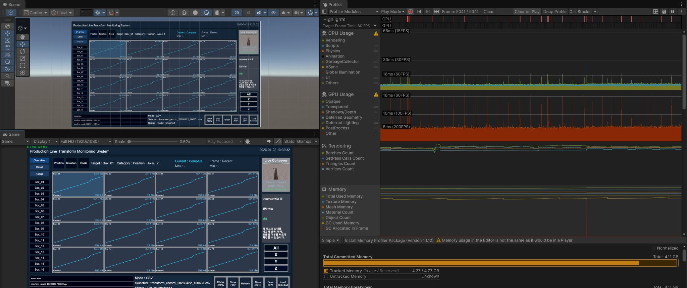

# 05. 검증 결과

## 테스트 환경

| 항목 | 내용 |
|:---|:---|
| Unity | 6000.3.10f1 |
| Platform | Windows |
| Architecture | Intel 64-bit |
| Main Scene | `Assets/Scenes/PL_TransformMonitor.unity` |
| Tracked Objects | Box_01~Box_16 |
| Buffer | 대상별 최대 600프레임 |

## 기능 검증

| 영역 | 검증 항목 | 결과 |
|:---|:---|:---:|
| Startup | Console Error 없이 시스템 시작 | PASS |
| Production Line | Box 16개 Spawn·이동·재활용 | PASS |
| Recorder | 각 Box의 Position·Rotation·Scale XYZ 기록 | PASS |
| Buffer | 대상별 최근 600프레임 유지 | PASS |
| Overview | 16개 카드, Current 값, 카드 선택 | PASS |
| Detail | 선택 대상 X·Y·Z·All 4분면 | PASS |
| Focus | 카테고리와 단일 축 확대 | PASS |
| Selection | Box_01~Box_16, Position·Rotation·Scale, All·X·Y·Z | PASS |
| Live View | 선택 대상 추적과 확대 화면 | PASS |
| Interpretation | State·Meaning·Risk·Insight 표시 | PASS |
| JSON | 저장 파일 생성과 역직렬화 | PASS |
| CSV | 타임스탬프 파일 생성과 행 파싱 | PASS |
| File Browser | 목록·선택·새로고침·상태 메시지 | PASS |
| Windows Build | Intel 64-bit Standalone 실행 | PASS |

세부 항목은 [최종 기능 테스트 체크리스트](qa/final_test_checklist.md)에 유지했습니다.

## Windows 독립 실행형 빌드 실행

Unity Editor가 아닌 Windows 실행 파일에서 생산 라인, 그래프와 파일 기능을 확인했습니다.

  

## JSON·CSV 파일 생성

`Application.persistentDataPath/PLT_Monitor/TransformRecords` 아래에 JSON과 타임스탬프 CSV 파일이 생성되는지 확인했습니다.

  

## 일반 실행 성능

- 프로젝트 요구 기준인 60FPS 이상을 충족한 것으로 최종 체크리스트에 기록돼 있습니다.
- 기존 QA 기록에서는 일반 실행 중 100FPS 이상을 유지했습니다.
- Overview·Detail·Focus 전환, 대상 선택과 Live View 사용에서 큰 끊김이 없다고 기록돼 있습니다.

성능 수치는 기존 QA 문서와 화면 측정 기록을 기준으로 정리했습니다.

## 저장 순간 Profiler 결과

Save JSON 또는 Save CSV를 실행하면 CPU와 GC Spike가 발생하고 기존 QA 기록상 약 40FPS 전후까지 일시 하락한 뒤 회복합니다.

현재 저장 과정은 메인 스레드에서 다음 작업을 연속 수행합니다.

1. 16개 Recorder의 프레임 목록 복사
2. 세션 DTO 구성
3. JSON 직렬화 또는 최대 9,600개 CSV 행 생성
4. 문자열 생성과 파일 I/O

  

## 검증 범위

Windows 독립 실행형 빌드의 단일 사용자 환경에서 Box 16개와 대상별 최대 600프레임을 기준으로 생산 라인 순환, Transform 기록, 단계별 그래프, Live View, JSON·CSV 저장·파싱과 저장 순간 성능 변화를 검증했습니다.

---

[문서 목차](README.md) · [프로젝트 README](../README.md)
