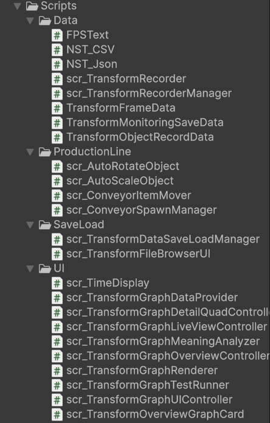

# 02. 역할과 기여

[← 포트폴리오 목차](README.md)

## 담당 범위

기존 프로젝트 문서에서 교육 과정 과제용 독립 프로젝트로 확인되며, PLT Monitor의 기획 정리부터 Unity 구조 구성, C# 데이터 파이프라인, 그래프 UI, 저장·불러오기, QA와 포트폴리오 자료 정리까지 직접 수행했습니다.

개발 기간과 기여율은 확인 가능한 근거가 없어 수치로 기재하지 않았습니다.

## 주요 기여

| 영역 | 직접 수행한 내용 | 결과 |
| --- | --- | --- |
| 요구사항 설계 | 16개 오브젝트, 600 프레임, 9축 데이터, 3단계 그래프 범위 정의 | 기능과 검증 기준 일치 |
| 생산 라인 | Conveyor 이동, Start/End Point, Box Pool 순환 구조 구현 | 오브젝트 생성 반복 없이 16개 재사용 |
| 데이터 기록 | Recorder와 RecorderManager, 직렬화 DTO 설계 | 오브젝트별 Transform 이력 수집 |
| 그래프 데이터 | DataProvider에서 오브젝트·카테고리·축 기준 포인트 변환 | 기록 형식과 UI 표현 분리 |
| 그래프 UI | Overview·Detail·Focus, 선택 버튼, 수치·상태 패널 구현 | 전체 탐색에서 단일 축 분석까지 연결 |
| 그래프 렌더링 | 선·축·라벨·다중 시리즈와 선택적 포인트 마커 렌더링 | 같은 Renderer를 여러 화면에서 재사용 |
| Live View | 전용 카메라와 RenderTexture, 시점 전환 UI 구성 | 그래프와 실제 이동 장면 동시 확인 |
| Save/Load | JSON·CSV 저장, 파일 브라우저, 선택 파일 파싱 구현 | 저장 결과를 외부에서 검토 가능 |
| QA | 체크리스트, Profiler 캡처, 샘플 파일, Windows 빌드 확인 | 결과와 known issue를 문서화 |
| 저장소 정리 | 외부 대용량 아이콘 에셋 제외 및 내부 point marker 제작 | 핵심 의존성 제거와 저장소 경량화 |

## 코드 책임 분리

### Data

- `scr_TransformRecorder`: 개별 오브젝트의 프레임 기록과 600개 제한
- `scr_TransformRecorderManager`: Scene의 Recorder 검색과 일괄 제어
- `TransformFrameData`: 한 프레임의 시간·Transform 9개 값
- `TransformObjectRecordData`: 오브젝트명과 프레임 묶음
- `TransformMonitoringSaveData`: 세션 단위 저장 루트
- `NST_Json`, `NST_CSV`: 파일 형식별 직렬화·파싱

### ProductionLine

- `scr_ConveyorSpawnManager`: 16개 Box Pool 초기화와 순환
- `scr_ConveyorItemMover`: 시작점 배치, 이동, 도착과 비활성화
- `scr_AutoRotateObject`, `scr_AutoScaleObject`: 회전·크기 변화 테스트 상태 생성

### UI와 SaveLoad

- `scr_TransformGraphDataProvider`: Recorder 데이터를 그래프 포인트로 변환
- `scr_TransformGraphRenderer`: 단일·다중 그래프 시각화
- `scr_TransformGraphUIController`: 선택 상태와 모드 전환 총괄
- `scr_TransformGraphOverviewController`, `scr_TransformOverviewGraphCard`: 16개 Overview 카드
- `scr_TransformGraphDetailQuadController`: X/Y/Z/All 4분면 구성
- `scr_TransformGraphLiveViewController`: Live View와 시점 전환
- `scr_TransformGraphMeaningAnalyzer`: 변화량·범위 기반 규칙 해석
- `scr_TransformDataSaveLoadManager`: 저장 데이터 구성과 JSON·CSV 처리
- `scr_TransformFileBrowserUI`: 저장 파일 목록·선택·상태 표시

## 기여 범위 표현 원칙

프로젝트가 실제 산업 설비나 외부 서버와 연동된 것으로 과장하지 않습니다. 생산 라인은 Unity 내부 시뮬레이션이며, 분석 문구는 규칙 기반입니다. 또한 선택 파일을 파싱하는 기능과 데이터를 그래프에 복원하는 기능을 명확히 구분합니다.

