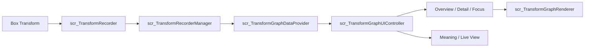
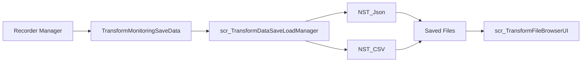

# 03. 기술 아키텍처

[← 포트폴리오 목차](README.md)

## 기술 스택

| 구분 | 기술 |
| --- | --- |
| Engine | Unity 6000.3.10f1 |
| Language | C# |
| Rendering | Universal Render Pipeline 17.3.0 |
| UI | Unity UI(uGUI) 2.0, TextMeshPro |
| Input | Unity Input System 1.18.0 |
| Serialization | Newtonsoft.Json 3.2.2, 자체 CSV 유틸리티 |
| Target | Windows Standalone |

## Scene과 Prefab 구조

Main Scene은 `Assets/Scenes/PL_TransformMonitor.unity`입니다.

```text
PL_TransformMonitor
├─ EventSystem
└─ PL_Root (PF_PL_Root)
   ├─ Environment
   ├─ ProductionLine
   │  ├─ Conveyor
   │  ├─ StartPoint
   │  ├─ EndPoint
   │  └─ FallBox
   ├─ TrackObjects
   │  ├─ Box_01 ... Box_16
   │  └─ BoxPool
   ├─ Props
   ├─ CameraRig
   ├─ Debug FPS
   └─ GraphSystem
      ├─ GraphDataProvider
      ├─ GraphUIController
      ├─ GraphLiveViewCamera
      ├─ OverviewController
      ├─ GraphTestRunner
      └─ GraphCanvas
```

상위 Prefab은 생산 라인과 GraphSystem을 조합하고, 세부 UI는 Graph Area, Overview Card, Detail Quad, Live View, File Browser 등의 Prefab으로 나뉩니다.

## 런타임 데이터 흐름



1. 각 Box의 Recorder가 프레임마다 Transform을 읽습니다.
2. 600개를 초과하면 가장 오래된 프레임을 제거합니다.
3. RecorderManager가 Scene의 Recorder 목록과 일괄 기록 상태를 관리합니다.
4. DataProvider가 선택한 오브젝트·Transform Category·Axis에 맞춰 `GraphPoint` 목록을 만듭니다.
5. UIController가 선택 상태와 화면 모드를 관리합니다.
6. Renderer가 좌표 정규화, 선·축·라벨과 선택적 point marker를 그립니다.

## 저장 흐름



JSON은 `Session → Objects → Frames` 계층을 유지합니다. CSV는 한 행을 오브젝트의 한 프레임으로 펼쳐 `ObjectName`, `FrameIndex`, `TimeStamp`, Position/Rotation/Scale XYZ 열을 기록합니다.

선택 파일을 불러올 때 JSON은 `TransformMonitoringSaveData`로 역직렬화하고, CSV는 행 목록으로 파싱합니다. 현재 구현은 성공 여부와 상태 문구까지만 UI에 전달합니다.

## 계층 분리의 이유

| 계층 | 책임 | 분리 효과 |
| --- | --- | --- |
| Recorder | 원본 Transform 이력 | UI 변경과 무관하게 기록 유지 |
| Manager | Recorder 수집·세션 구성 | 다중 오브젝트 일괄 처리 |
| DataProvider | 그래프 포인트 조회 | 저장 DTO와 표시 형식의 결합 완화 |
| Renderer | 좌표·선·라벨 표현 | 여러 모드에서 시각 설정 재사용 |
| UI Controller | 선택·전환·상태 | 입력 상태를 한 곳에서 조정 |

## 주요 스크립트 역할

| 분류 | 스크립트 | 역할 |
| --- | --- | --- |
| Data | `scr_TransformRecorder` | 개별 오브젝트의 Transform을 기록하고 최근 600 Frames 유지 |
| Data | `scr_TransformRecorderManager` | Scene의 Recorder 검색, 일괄 시작·정지와 저장용 목록 제공 |
| Data | `TransformFrameData` | 프레임·시간과 Position/Rotation/Scale XYZ 정의 |
| Data | `TransformObjectRecordData` | 오브젝트명과 프레임 배열 구성 |
| Data | `TransformMonitoringSaveData` | 세션명·생성 시각·오브젝트 배열을 묶는 저장 루트 |
| ProductionLine | `scr_ConveyorSpawnManager` | 16개 Box Pool 초기화와 재사용 주기 관리 |
| ProductionLine | `scr_ConveyorItemMover` | StartPoint–EndPoint 이동과 도착 후 비활성화 |
| Graph | `scr_TransformGraphDataProvider` | Recorder 기록을 Category·Axis별 GraphPoint로 변환 |
| Graph | `scr_TransformGraphRenderer` | 단일·다중 선, 축, 라벨과 point marker 렌더링 |
| UI | `scr_TransformGraphUIController` | 오브젝트·Category·Axis 선택과 화면 모드 총괄 |
| UI | `scr_TransformGraphOverviewController` | 16개 Overview Card 생성·갱신 |
| UI | `scr_TransformGraphDetailQuadController` | X·Y·Z·All 네 그래프 구성 |
| UI | `scr_TransformGraphLiveViewController` | 선택 대상, Live View 확대와 카메라 시점 전환 |
| UI | `scr_TransformGraphMeaningAnalyzer` | 변화량·범위 기반 State/Meaning/Risk/Insight 생성 |
| SaveLoad | `scr_TransformDataSaveLoadManager` | 저장 DTO 구성, JSON·CSV 저장과 파일 파싱 |
| SaveLoad | `scr_TransformFileBrowserUI` | 확장자별 목록, 선택 파일과 처리 상태 표시 |
| Utility/Test | `FPSText`, `scr_TransformGraphTestRunner` | FPS 표시와 그래프 연결 점검 |
