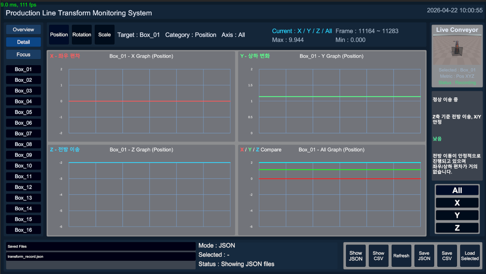
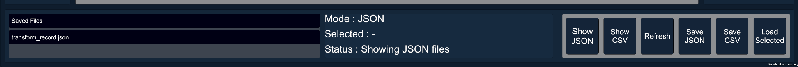

# 04. 핵심 기능

[← 포트폴리오 목차](README.md)

## 1. 생산 라인과 16개 오브젝트

`scr_ConveyorSpawnManager`가 16개 Box를 미리 준비하고, `scr_ConveyorItemMover`가 StartPoint에서 EndPoint까지 이동시킵니다. 도착한 오브젝트는 새로 생성·파괴하지 않고 풀로 돌아가 다시 활성화됩니다. 회전과 크기 변화 컴포넌트를 조합해 Position 이외의 데이터도 관찰할 수 있습니다.

## 2. Transform rolling record

각 오브젝트의 `scr_TransformRecorder`는 다음 값을 프레임 단위로 저장합니다.

```text
frameIndex, timeStamp
position.x, position.y, position.z
rotation.x, rotation.y, rotation.z
scale.x, scale.y, scale.z
```

오브젝트마다 최근 600개 프레임만 유지하므로 실행 시간이 길어져도 기록 목록이 무한히 증가하지 않습니다. 16개 기준 최대 9,600개 프레임과 86,400개 Transform 수치를 현재 분석 구간으로 관리합니다.

## 3. Overview → Detail → Focus

### Overview

16개 Box의 그래프 카드를 한 화면에 표시해 전체 흐름과 눈에 띄는 오브젝트를 먼저 탐색합니다.


### Detail

선택한 Box와 Position·Rotation·Scale 중 하나를 X, Y, Z, All 4분면으로 비교합니다. 현재값, 최솟값, 최댓값과 프레임 범위를 함께 확인합니다.



### Focus

선택한 단일 축 그래프를 크게 표시해 변화 구간과 세부 추세를 집중해서 봅니다.


세 모드는 서로 다른 기능을 나열한 것이 아니라 “전체 탐색 → 오브젝트 비교 → 단일 축 집중”으로 분석 범위를 좁히는 하나의 UX입니다.

## 4. 상태 해석 패널

`scr_TransformGraphMeaningAnalyzer`는 그래프의 변화량과 범위 등을 기준으로 State, Meaning, Risk, Insight 문구를 구성합니다. 이는 관찰을 돕는 규칙 기반 해석이며, 학습 모델이나 고장 예측 AI가 아닙니다.

## 5. Live View

전용 카메라가 생산 라인을 RenderTexture에 출력합니다. 선택한 오브젝트·지표 상태와 함께 정면, 측면, 사선 시점을 전환할 수 있으며, 확대 화면을 닫아 대시보드로 복귀합니다.


## 6. JSON·CSV Save/Load

| 기능 | 동작 |
| --- | --- |
| Save JSON | 세션·오브젝트·프레임 계층을 JSON으로 직렬화 |
| Save CSV | 프레임별 행과 Transform 열을 CSV로 기록 |
| Show JSON / CSV | 확장자별 저장 파일 목록 표시 |
| Refresh | 현재 저장 폴더 다시 검색 |
| Load Selected | 선택 경로의 파일을 읽고 파싱 성공·실패 상태 표시 |



`Load Selected`는 JSON·CSV의 형식 검토와 상태 피드백까지 구현되어 있습니다. 불러온 프레임을 실행 중 오브젝트나 그래프에 복원하는 Replay 기능은 구현 범위 밖입니다.

## 7. 포트폴리오 샘플

- [JSON 샘플](../samples/transform_record_sample.json): 세션과 16개 오브젝트 계층 확인
- [CSV 샘플](../samples/transform_record_sample.csv): 헤더 포함 9,601행, 즉 데이터 9,600행 확인

